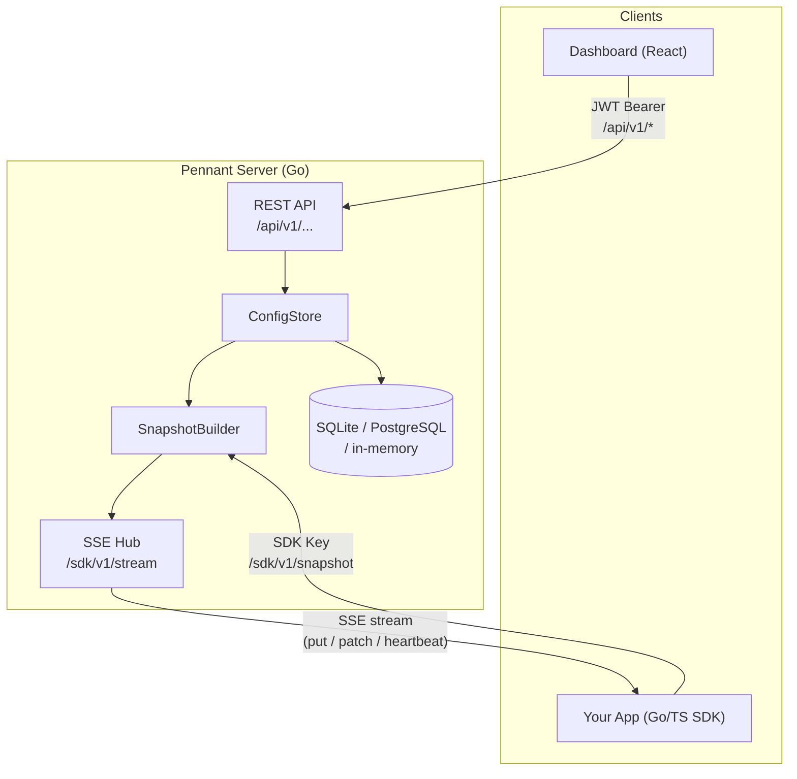

# Pennant

Self-hosted feature flag service with real-time SSE streaming, built-in A/B testing, and first-party Go and TypeScript SDKs.

## Why Pennant?

**No evaluation round-trips.** Flags evaluate locally in the SDK using an in-memory snapshot — a `BoolVariation` call is a hash table lookup and an integer comparison, not a network request.

**Always-valid sequential statistics.** The A/B testing engine uses mSPRT (mixture Sequential Probability Ratio Test), which gives valid p-values at any sample size. You can peek at results without inflating the false positive rate.

**Cross-SDK parity guaranteed.** 45+ JSON conformance fixtures run against both the Go and TypeScript evaluation engines on every CI push. Both SDKs must produce identical results for every fixture.

**Production-hardened from day one.** JWT/RBAC auth, token bucket rate limiting, Prometheus metrics, structured JSON logging, health probes, graceful shutdown, and configurable CORS.

## Quick install

=== "Docker Compose"
    ```bash
    git clone https://github.com/sanskarpan/pennant
    cd pennant
    cp .env.example .env
    # set PENNANT_JWT_SECRET=<32+ chars>
    docker compose up
    ```
    Open [http://localhost:8080](http://localhost:8080) — login with `admin@pennant.local` / `admin`.

=== "Binary"
    ```bash
    go build -o pennant-server ./cmd/server
    PENNANT_JWT_SECRET=change-me SQLITE_PATH=./pennant.db ./pennant-server
    ```

=== "From source"
    ```bash
    # Build frontend (requires Bun)
    cd frontend && bun install && bun run build && cd ..
    # Build server
    CGO_ENABLED=1 go build -o pennant-server ./cmd/server
    PENNANT_JWT_SECRET=change-me SQLITE_PATH=./pennant.db ./pennant-server
    ```

## Feature overview

| Category | Details |
|---|---|
| Evaluation engine | SHA-1 bucketing, 14 clause operators, prerequisites, segments, rollouts |
| Storage | SQLite (single-node), PostgreSQL (multi-node), in-memory (tests) |
| Streaming | SSE hub, non-blocking fan-out, EventRing delta replay |
| Auth | JWT HS256, 4-tier RBAC, rotating refresh tokens |
| A/B testing | mSPRT, z-test, Welford online stats, SRM detection |
| Observability | Prometheus metrics, structured logging, /health, /ready |
| SDKs | Go (atomic snapshot, type-safe eval), TypeScript (BigInt bucketing) |
| Deployment | Docker, docker-compose, Kubernetes probes, Let's Encrypt |

## Architecture at a glance



Flags are evaluated **entirely inside the SDK process**. The server is only on the critical path for initial snapshot load and for streaming incremental flag updates. Once the SDK has its snapshot, evaluation continues even if the server is temporarily unreachable.

## Default seed data

On first start Pennant seeds:

- **Admin user:** `admin@pennant.local` / `admin` (role: `owner`)
- **Project:** `default`
- **Environment:** `production`
- **SDK keys:** `sdk-server-default-prod`, `sdk-client-default-prod`

Change the admin password immediately in production.
